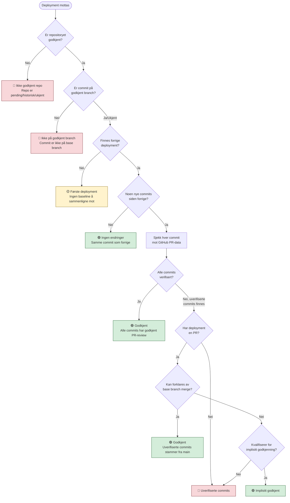

# Verifisering av fire-øyne-prinsippet

> **Målgruppe**: Utviklere, ledere og internrevisjon/kontrollere.
>
> **Formål**: Dokumentere hvordan Deployment Audit automatisk verifiserer at alle deployments til Nav sin Nais-plattform har hatt minst to personer involvert i kodeendringen (fire-øyne-prinsippet).

## Innholdsfortegnelse

- [Overordnet](#overordnet)
- [Beslutningsflyt](#beslutningsflyt)
- [Verifikasjonsresultater (statuser)](#verifikasjonsresultater-statuser)
- [Årsaker til manglende verifisering](#årsaker-til-manglende-verifisering)
- [PR-verifisering i detalj](#pr-verifisering-i-detalj)
- [Implisitt godkjenning](#implisitt-godkjenning)
- [Kodereferanser](#kodereferanser)
- [Ordliste](#ordliste)

---

## Overordnet

### Hva er fire-øyne-prinsippet?

Fire-øyne-prinsippet (four-eyes principle) betyr at minst **to personer** skal ha sett på en kodeendring før den settes i produksjon. I praksis betyr dette at:

1. Én person skriver koden
2. En annen person godkjenner koden (via en **pull request-review** på GitHub)

### Hva sjekker applikasjonen?

For hvert deployment sjekker systemet:

- Hvilke **commits** som er nye siden forrige deployment
- Om hver commit tilhører en **pull request** (PR) med godkjent review
- Om godkjenningen skjedde **etter siste commit** i PR-en (for å unngå at kode legges til etter godkjenning)
- Om den som godkjente er en **annen person** enn den som skrev koden

### Datakilder

| Kilde | Hva hentes | Når |
|-------|-----------|-----|
| **Nais API** | Deployments (app, tidspunkt, commit-SHA, miljø) | Periodisk hvert 5. minutt |
| **GitHub API** | Commits mellom deployments, PR-metadata, reviews, godkjenninger | Ved verifisering av hvert deployment |
| **GitHub API (repo metadata)** | `default_branch` for hver overvåket app | Periodisk, maks én gang per app per 24 timer |

#### Auto-deteksjon av default_branch

`monitored_applications.default_branch` brukes til å filtrere PR-er ved verifisering — kun PR-er med `base.ref` som matcher denne verdien telles. For å unngå feilkonfigurasjon (f.eks. konfigurert `main` mens repoet faktisk bruker `master`) hentes feltet fra GitHub som del av synkroniseringssyklusen, med 24t cooldown per app. Når **deployment-commiten selv** ikke har en tilknyttet PR mot konfigurert default-branch, og GitHub i stedet returnerer en PR mot en annen branch, vises en advarsel («Mulig feil-konfigurert default-branch») på deployment-detaljsiden inntil neste sync har korrigert verdien. Advarselen vises kun basert på deployment-commitens PR — ikke basert på enkeltcommits i rekken mellom to deployments. Dette er fordi commits legitimt kan ha gått gjennom en testbranch (f.eks. sandbox) på vei til main uten at appens konfigurasjon er feil.

#### Prinsipp: GitHub er eneste autoritative kilde ved verifisering

`monitored_applications.default_branch` og andre DB-cachede verdier kan være foreldet — f.eks. om et repo har omdøpt default-branchen etter sist synkronisering. **Branch-relaterte data som lagres på et deployment (f.eks. `branch_name`) må alltid hentes direkte fra GitHub ved verifiseringstidspunktet**, ikke utledes fra cachede DB-verdier.

I praksis betyr dette:
- `detectedBranchName` hentes fra `deployedPr.metadata.headBranch` (GitHub PR API) eller `getBranchFromWorkflowRun()` (GitHub Actions API) — begge direkte fra GitHub ved verifisering
- `baseBranch` fra DB skal **ikke** brukes som kilde for `branch_name`, selv om `commitOnBaseBranch === true`, fordi verdien kan reflektere en annen branch enn den som faktisk var default på deployment-tidspunktet

### Prosessflyt på overordnet nivå

```
Nais API → Nye deployments oppdages → Lagres i database (status: "Venter")
                                            ↓
                                    GitHub API → Hent commits og PR-data
                                            ↓
                                    Verifiseringslogikk → Bestem status
                                            ↓
                                    Resultat lagres i database
```

---

## Beslutningsflyt

Når et deployment skal verifiseres, går systemet gjennom følgende beslutningstrinn:



### Steg-for-steg forklaring

#### Steg 0: Er repositoryet godkjent?

Før noen annen verifisering sjekkes om deploymentets repository er registrert og godkjent (`active`) for applikasjonen. Hvis repositoryet har status `pending_approval`, `historical`, eller ikke er registrert i det hele tatt (`unknown`), avvises verifiseringen umiddelbart med status **`unauthorized_repository`**. Dette forhindrer at deployments fra uautoriserte kilder kan bli markert som godkjent.

> 📁 Se `handleUnauthorizedRepository` i [`verify.ts`](../app/lib/verification/verify.ts) og `findRepositoryForApp` i [`application-repositories.server.ts`](../app/db/application-repositories.server.ts)

#### Steg 0b: Er commit på godkjent branch?

Systemet bruker GitHub Compare API til å sjekke om den deployede commit-SHAen befinner seg på applikasjonens konfigurerte base-branch (f.eks. `main`). Hvis committen **ikke** er på base-branchen, betyr det at noen har deployet fra en feature-branch eller annen uautorisert branch. Status: **`unauthorized_branch`**.

Hvis API-kallet feiler (f.eks. midlertidig nettverksproblem), fortsetter verifiseringen normalt (**fail-open**) — det er bedre å sjekke fire-øyne enn å blokkere alt.

> 📁 Se `handleUnauthorizedBranch` i [`verify.ts`](../app/lib/verification/verify.ts) og `isCommitOnBranch` i [`github.server.ts`](../app/lib/github.server.ts)

#### Steg 1: Finnes forrige deployment?

Hvis dette er **første gang** applikasjonen deployes (ingen tidligere deployment i databasen), kan vi ikke vite hvilke commits som er nye. Deploymentet får status **`pending_baseline`** — det fungerer som referansepunkt for fremtidige deployments.

> **Merk:** Legacy-deployments (importert historikk med ugyldige commit-referanser som `refs/heads/...`) filtreres bort ved søk etter forrige deployment. Første deployment etter legacy-perioden behandles derfor som `pending_baseline`.
>
> Tilsvarende filtreres deployments som ligger før appens `audit_start_year` bort. Første deployment innenfor revisjonsperioden behandles som `pending_baseline` selv om det finnes eldre pre-revisjons-deployments. Dette gjelder både live verifisering og pre-beregningen av verifiseringsavvik (`compute-diffs`).

**Gruppe-fallback:** Hvis appen tilhører en *applikasjonsgruppe* og det ikke finnes en forrige deployment i **samme miljø**, leter systemet etter en forrige deployment fra **samme Git-repo i et søskenmiljø** innenfor gruppen. Dette unngår unødvendige `pending_baseline` når en ny miljøvariant (f.eks. prod-gcp) legges til for en app som allerede har historikk i et annet miljø (f.eks. prod-fss).

#### Steg 2: Er det noen nye commits?

Systemet henter listen over commits mellom forrige deployment sin commit-SHA og nåværende deployment sin commit-SHA via GitHub API.

##### Samme commit-SHA (re-deploy)
- Deploymentet er en **re-deploy** av eksakt samme kode. Status: **`no_changes`**.

##### Samme commit-SHA men GitHub compare returnerer 'identical'
- Hvis GitHub compare-API returnerer `status = 'identical'`, bekrefter det at begge commitene er identiske. Status: **`no_changes`**.

##### Forskjellig commit-SHA — no-diff-deteksjon

Når GitHub compare returnerer 0 commits til tross for ulike SHAer, bruker systemet **compare-metadata** og en **tree-comparison-fallback** for å skille ekte «ingen diff» fra rollback, branch-divergens og API-feil:

**Steg 1: Tree-comparison-fallback (for ambigøse tilfeller)**
- Hvis begge commits har **identiske commit trees** (`tree.sha` match) → **Ekte no-diff** ✓
  - Eksempel: To brancher som ble opprettet fra samme commit, deretter rebased eller reordered, men som nå peker på kode med samme tree
- Hvis **tree-sjekken finner ulik trees** eller **feiler** → Fortsett til steg 2

**Steg 2: Sjekk nærliggende godkjente deployments (for rollback-scenario)**

Hvis ingen av stegene over bekreftet no-diff:
1. **Nærliggende deployment med samme commit-SHA** (±30 min) som allerede er godkjent → behandles som retry/duplikat, status: **`no_changes`**.
2. **Nærliggende deployment med annen commit-SHA** (±30 min) som er godkjent → mulig *superseded deploy* (heuristikk, ikke ancestry-verifisert), status: **`no_changes`**. Typisk ved rapid-fire deploys der webhook-rekkefølge ikke matcher merge-rekkefølge.
3. Ingen nærliggende godkjent deployment → Status: **`error`**. Krever manuell vurdering.

**Når returneres error?**
- `compareFailed = true` → GitHub compare API feilet (403 Forbidden, 404 Not Found, 500, osv.). Status: **`error`** — GitHub App må sjekkes.
- Ulike SHAer, 0 commits, og `noDiffDetected = false` → Trolig rollback eller branch-divergens med faktisk kodeendringer. Status: **`error`** — krever manuell vurdering.

#### Steg 3: Sjekk hver commit individuelt

For hver commit mellom forrige og nåværende deployment:

1. **Base-branch merge-commits** hoppes over (`Merge branch 'main' into ...`) — disse bringer allerede verifisert kode inn i feature-branchen
2. **Andre merge-commits** (f.eks. `Merge branch unapproved-feature`) verifiseres som vanlige commits — de kan inneholde kodeendringer fra konfliktløsning
3. **Commit i deployed PR**: Hvis commiten tilhører PR-en som ble deployet, sjekkes den PR-ens godkjenningsstatus
4. **Commit med egen PR**: Hvis commiten har en tilknyttet PR (f.eks. en squash-merge fra en annen branch), sjekkes den PR-ens godkjenningsstatus
5. **Commit uten PR**: Commiten er pushet direkte til main uten PR — dette er en **direkte push** og kan ikke verifiseres automatisk

#### Steg 4: Alle commits verifisert?

Hvis alle ikke-merge commits har en godkjent PR-review → status **`approved`**.

#### Steg 5: Base branch merge?

Noen ganger har en PR commits som ikke ble reviewet, men som stammer fra at utvikleren har merget `main` inn i sin feature-branch for å holde den oppdatert. Systemet sjekker:

- Finnes det en merge-commit som bringer `main` inn i feature-branchen?
- Er alle uverifiserte commits datert **før** denne merge-commiten?
- Har PR-en minst én godkjent review?

Hvis ja → status **`approved`** (med metode `base_merge`).

#### Steg 6: Implisitt godkjenning?

For visse typer PR-er kan selve **merge-handlingen** fungere som den andre personen sin godkjenning. Se [Implisitt godkjenning](#implisitt-godkjenning) for detaljer.

#### Steg 7: Uverifiserte commits

Hvis ingen av stegene over fører til godkjenning, forblir deploymentet **uverifisert**. Hver uverifisert commit får en spesifikk årsak (se [Årsaker til manglende verifisering](#årsaker-til-manglende-verifisering)).

---

## Verifikasjonsresultater (statuser)

Hvert deployment får én av følgende statuser etter verifisering:

| Status | Norsk navn | Godkjent? | Beskrivelse |
|--------|-----------|-----------|-------------|
| `approved` | Godkjent | ✅ Ja | Alle commits har godkjent PR-review |
| `implicitly_approved` | Implisitt godkjent | ✅ Ja | Godkjent via implisitte regler (f.eks. Dependabot) |
| `no_changes` | Ingen endringer | ✅ Ja | Re-deploy av eksakt samme commit, eller compare/tree bekrefter at det ikke finnes kodeendringer |
| `pending_baseline` | Første deployment | ⚠️ Nei | Første deployment — brukes som referansepunkt |
| `unverified_commits` | Uverifiserte commits | ❌ Nei | Én eller flere commits mangler godkjent PR-review |
| `unauthorized_repository` | Ikke godkjent repo | ❌ Nei | Deploymentets repo er ikke godkjent for applikasjonen |
| `unauthorized_branch` | Ikke på godkjent branch | ❌ Nei | Deployet commit er ikke på konfigurert base-branch |
| `manually_approved` | Manuelt godkjent | ✅ Ja | Manuelt godkjent av administrator i applikasjonen |
| `legacy` | Legacy | ⚠️ N/A | Deployment fra før audit-systemet ble aktivert |
| `error` | Feil | ❌ Nei | Teknisk feil under verifisering, eller tvetydig compare med ulike commit-SHAer og reell diff/branch-divergens |

> **Koderef**: Enum `VerificationStatus` i [`app/lib/verification/types.ts`](../app/lib/verification/types.ts)

### Tilleggsstatuser i databasen

Databasekolonnen `four_eyes_status` har noen flere verdier som stammer fra eldre versjoner eller spesialtilfeller:

| Status | Beskrivelse |
|--------|-------------|
| `approved_pr` | Eldre alias for `approved` |
| `pending` / `pending_approval` | Venter på verifisering |
| `direct_push` | Direkte push uten PR (eldre klassifisering) |
| `approved_pr_with_unreviewed` | PR godkjent, men med uverifiserte commits fra main-merge |
| `repository_mismatch` | Repository matcher ikke forventet overvåket app |

> **Koderef**: Enum `FourEyesStatus` i [`app/lib/four-eyes-status.ts`](../app/lib/four-eyes-status.ts)

---

## Årsaker til manglende verifisering

Når en commit ikke kan verifiseres, tildeles en spesifikk årsak:

| Årsak | Norsk forklaring | Typisk scenario |
|-------|-----------------|-----------------|
| `no_pr` | Ingen PR funnet | Commit pushet direkte til `main` uten PR |
| `no_approved_reviews` | Ingen godkjent review | PR eksisterer, men ingen har trykket «Approve» |
| `approval_before_last_commit` | Godkjenning før siste commit | Noen godkjente PR-en, men så ble det pushet nye commits etterpå |
| `pr_not_approved` | PR ikke godkjent | Annen grunn til at PR-en mangler gyldig godkjenning |

> **Koderef**: Enum `UnverifiedReason` i [`app/lib/verification/types.ts`](../app/lib/verification/types.ts)

---

## PR-verifisering i detalj

### Hva sjekkes i en pull request?

Når systemet evaluerer om en PR har fire-øyne-godkjenning, sjekkes følgende:

1. **Finnes godkjente reviews?** — Minst én review med status `APPROVED`
2. **Er godkjenningen gitt etter siste reelle commit?** — En review gitt *før* siste commit er utdatert (noen kan ha lagt til kode etter godkjenning). For å motvirke manipulering av git-datoer brukes **den seneste av `authorDate` og `committerDate`** — dette krever at begge datoer må manipuleres for å omgå kontrollen
3. **Ignorering av base branch merge-commits** — Commits av typen `Merge branch 'main' into feature-x` regnes ikke som reelle kodeendringer

### Tidslinjekontroll

```
Commit A → Commit B → Review (APPROVED ✅) → Merge
                                ↑
                        Godkjenning etter siste commit = OK

Commit A → Review (APPROVED ✅) → Commit B → Merge
                                     ↑
                        Ny commit etter godkjenning = IKKE OK
```

### Unntaket: Merger som «andre øyne»

Hvis en PR har godkjente reviews, men godkjenningen var **før** siste commit, sjekkes det om **personen som merget PR-en** er en annen enn commit-forfatterne. Hvis ja, regnes merge-handlingen som validering — mergeren så den endelige tilstanden og valgte å merge.

> **Koderef**: Funksjon `verifyFourEyesFromPrData` i [`app/lib/verification/verify.ts`](../app/lib/verification/verify.ts)

### Base branch merge-deteksjon

Noen ganger oppstår uverifiserte commits fordi utvikleren har merget `main` inn i sin feature-branch. Disse commits ble allerede verifisert da de ble merget til `main` via sine egne PR-er. Systemet gjenkjenner dette mønsteret:

1. Finn merge-commiten (f.eks. `Merge branch 'main' into feature-x`)
2. Sjekk at alle uverifiserte commits er datert **før** merge-commiten
3. Sjekk at PR-en har minst én godkjent review

Hvis alle tre kriterier er oppfylt → deploymentet godkjennes med metode `base_merge`.

> **Koderef**: Funksjoner `isBaseBranchMergeCommit` og `shouldApproveWithBaseMerge` i [`app/lib/verification/verify.ts`](../app/lib/verification/verify.ts)

---

## Implisitt godkjenning

Implisitt godkjenning er en konfigurerbar mekanisme som lar visse typer deployments bli godkjent uten eksplisitt PR-review. Innstillingen konfigureres per overvåket applikasjon.

### Moduser

| Modus | Norsk navn | Regel |
|-------|-----------|-------|
| `off` | Av | Ingen implisitt godkjenning. Krever alltid eksplisitt review. |
| `dependabot_only` | Kun Dependabot | Godkjenner PR-er opprettet av Dependabot med kun Dependabot-commits, **forutsatt** at en annen person merget PR-en. |
| `all` | Alle PR-er | Godkjenner PR-er der personen som merget er **forskjellig fra** PR-forfatteren og siste commit-forfatter. Merge-handlingen fungerer da som «andre øyne». |

### Eksempler

**Dependabot-modus** (`dependabot_only`):
- ✅ Dependabot oppretter PR → Dependabot committer → Utvikler merget → Implisitt godkjent
- ❌ Dependabot oppretter PR → Utvikler legger til commit → Utvikler merget → Ikke godkjent (manuell commit)

**Alle-modus** (`all`):
- ✅ Utvikler A oppretter PR → Utvikler A committer → Utvikler B merger → Implisitt godkjent
- ❌ Utvikler A oppretter PR → Utvikler A committer → Utvikler A merger → Ikke godkjent (samme person)

> **Koderef**: Funksjon `checkImplicitApproval` i [`app/lib/verification/verify.ts`](../app/lib/verification/verify.ts),
> enum `ImplicitApprovalMode` i [`app/lib/verification/types.ts`](../app/lib/verification/types.ts)

---

## Kodereferanser

### Verifiseringslogikk (ren, uten sideeffekter)

| Fil | Ansvar | Sentrale funksjoner |
|-----|--------|-------------------|
| [`app/lib/verification/verify.ts`](../app/lib/verification/verify.ts) | Beslutningslogikk for fire-øyne-verifisering | `verifyDeployment`, `verifyFourEyesFromPrData`, `shouldApproveWithBaseMerge`, `checkImplicitApproval` |
| [`app/lib/verification/types.ts`](../app/lib/verification/types.ts) | Typer, enumer og labels | `VerificationStatus`, `UnverifiedReason`, `ImplicitApprovalMode`, `VerificationInput`, `VerificationResult` |

### Orkestrering (henting, lagring, kjøring)

| Fil | Ansvar | Sentrale funksjoner |
|-----|--------|-------------------|
| [`app/lib/verification/index.ts`](../app/lib/verification/index.ts) | Komplett verifiseringsflyt (hent → verifiser → lagre) | `runVerification`, `reverifyDeployment`, `runDebugVerification` |
| [`app/lib/verification/fetch-data.server.ts`](../app/lib/verification/fetch-data.server.ts) | Henter data fra GitHub/cache | `fetchVerificationData`, `fetchVerificationDataForAllDeployments` |
| [`app/lib/verification/store-data.server.ts`](../app/lib/verification/store-data.server.ts) | Lagrer resultat til database | `storeVerificationResult` |

### Periodisk synkronisering

| Fil | Ansvar | Sentrale funksjoner |
|-----|--------|-------------------|
| [`app/lib/sync/scheduler.server.ts`](../app/lib/sync/scheduler.server.ts) | Periodisk kjøring av alle jobber | `startPeriodicSync`, `runPeriodicSync` |
| [`app/lib/sync/github-verify.server.ts`](../app/lib/sync/github-verify.server.ts) | Batch-verifisering av deployments | `verifyDeploymentsFourEyes`, `verifySingleDeployment` |
| [`app/lib/sync/nais-sync.server.ts`](../app/lib/sync/nais-sync.server.ts) | Henter deployments fra Nais API | `syncNewDeploymentsFromNais` |

### Statuser og kategorisering

| Fil | Ansvar | Sentrale funksjoner |
|-----|--------|-------------------|
| [`app/lib/four-eyes-status.ts`](../app/lib/four-eyes-status.ts) | Database-statuser med labels og kategorisering | `FourEyesStatus`, `isApprovedStatus`, `isNotApprovedStatus` |

### Tester

| Fil | Dekker |
|-----|--------|
| [`app/lib/__tests__/four-eyes-verification.test.ts`](../app/lib/__tests__/four-eyes-verification.test.ts) | PR-review, squash merge, Dependabot-scenarier |
| [`app/lib/__tests__/verify-coverage-gaps.test.ts`](../app/lib/__tests__/verify-coverage-gaps.test.ts) | Alle 7 beslutningssteg i `verifyDeployment`, sikkerhetstester |
| [`app/lib/__tests__/v1-unverified-reasons.test.ts`](../app/lib/__tests__/v1-unverified-reasons.test.ts) | Komplekse multi-commit scenarier |

---

## No-diff-deteksjon (GitHub compare-metadata + tree-fallback)

Når GitHub API returnerer 0 commits mellom to commits, kan dette bety:

1. **Ekte no-diff** — samme kode (commit-tree) på to ulike commits
2. **Rollback** — ny commit som er en eldre versjon av koden
3. **Branch-divergens** — to brancher som har gått ut av fase
4. **API-feil** — GitHub repo-tilgang, rate-limiting, eller server-feil

Systemet bruker en **tre-trinns strategi** for å skille disse scenarioene:

**Trinn 1: GitHub compare-metadata**
- Hvis `compare.status = 'identical'` + `changedFiles = 0` → Ekte no-diff ✓
- Hvis `status = 'diverged'` + `0 commits` + `0 files` → Ambigøst, gå til trinn 2

**Trinn 2: Commit-tree-sammenligning (fallback)**
- Hvis begge commits har **samme `.tree.sha`** → Ekte no-diff ✓
- Hvis trees er **ulike** → Trolig rollback/divergens, gå til trinn 3

**Trinn 3: Nærliggende godkjente deployments**
- **Samme commit-SHA** (±30 min) godkjent → retry/duplikat
- **Annen commit-SHA** (±30 min) godkjent → mulig superseded deploy (heuristikk, ikke ancestry-verifisert)
- **Ingen match** → `error` status, krever manuell gjennomgang

**GitHub API-feil:**
- Hvis `compareFailed = true` (403, 404, 500, osv.) → `error` status, løs GitHub App-tilgang

> **Implementering**: 
> - Tree-comparison: `haveSameCommitTree()` i [`app/lib/github/git.server.ts`](../app/lib/github/git.server.ts)
> - Orkestrering: `fetchCommitsBetween()` i [`app/lib/verification/fetch-data.server.ts`](../app/lib/verification/fetch-data.server.ts)
> - Beslutningslogikk: `verifyDeployment()` og `handleNoChanges()` i [`app/lib/verification/verify.ts`](../app/lib/verification/verify.ts)
> - Tester: [`app/lib/__tests__/verify-coverage-gaps.test.ts`](../app/lib/__tests__/verify-coverage-gaps.test.ts) — Case 2b (no-diff via compare) + GitHub API-feil

---

## Sikkerhetshensyn

### Merge-commits med kodeendringer

Ved konfliktløsning i merge-commits kan utviklere legge inn vilkårlige kodeendringer som ikke er del av noen PR. Systemet håndterer dette ved å **kun hoppe over base-branch merge-commits** (f.eks. `Merge branch 'main' into feature-x`). Andre merge-commits verifiseres som vanlige commits og flagges dersom de ikke tilhører en godkjent PR.

> 📁 Se `findUnverifiedCommits` i [`verify.ts`](../app/lib/verification/verify.ts) og test i [`verify-coverage-gaps.test.ts`](../app/lib/__tests__/verify-coverage-gaps.test.ts)

### Beskyttelse mot dato-manipulering

Git tillater at forfattere setter vilkårlig `authorDate` på commits. En ondsinnet utvikler kan backdatere en commit til å se ut som den ble laget *før* en PR-godkjenning. Systemet motvirker dette ved å bruke **den seneste av `authorDate` og `committerDate`**. `committerDate` settes av git-serveren ved push/rebase og er vanskeligere å manipulere.

> 📁 Se `latestCommitDate` og `verifyFourEyesFromPrData` i [`verify.ts`](../app/lib/verification/verify.ts)

### Branch-validering

Systemet sjekker om den deployede commit-SHAen befinner seg på applikasjonens konfigurerte base-branch (f.eks. `main`) via GitHub Compare API. Hvis committen ikke er på base-branchen, kan det bety at noen har deployet direkte fra en feature-branch — uten at koden nødvendigvis er merget. Slike deployments markeres som **`unauthorized_branch`**.

Sjekken bruker **fail-open**: hvis GitHub API-kallet feiler, fortsetter verifiseringen normalt. Dette sikrer at midlertidige nettverksproblemer ikke blokkerer all verifisering.

> 📁 Se `isCommitOnBranch` i [`github.server.ts`](../app/lib/github.server.ts) og `handleUnauthorizedBranch` i [`verify.ts`](../app/lib/verification/verify.ts)

### Repository-validering

Før verifisering sjekkes om deploymentets repository er registrert og godkjent (`active`) for applikasjonen. Deployments fra repositorier med status `pending_approval`, `historical` eller uten registrering markeres som **`unauthorized_repository`**.

> 📁 Se `handleUnauthorizedRepository` i [`verify.ts`](../app/lib/verification/verify.ts) og `findRepositoryForApp` i [`application-repositories.server.ts`](../app/db/application-repositories.server.ts)

---

## Ordliste

| Begrep | Forklaring |
|--------|-----------|
| **Fire-øyne-prinsippet** | Prinsippet om at minst to personer skal ha sett på en kodeendring |
| **Deployment** | En utrulling av kode til et kjøremiljø (f.eks. produksjon) |
| **Commit** | En enkelt kodeendring i Git-historikken |
| **Pull request (PR)** | En forespørsel om å flette kodeendringer inn i hovedbranchen |
| **Review** | En gjennomgang og vurdering av kodeendringer i en PR |
| **Approve** | Å godkjenne en PR etter review |
| **Merge** | Å flette kodeendringer fra en PR inn i hovedbranchen |
| **Merge-commit** | En teknisk commit som oppstår ved sammenfletting av brancher |
| **Base branch** | Hovedbranchen (typisk `main`) som PR-er merges inn i |
| **Squash merge** | En merge-strategi der alle commits i en PR komprimeres til én commit |
| **Dependabot** | GitHubs automatiske bot for oppdatering av avhengigheter |
| **Nais** | Nav sin applikasjonsplattform basert på Kubernetes |
| **SHA** | Unik identifikator (hash) for en commit |
| **Snapshot** | Lagret kopi av GitHub-data i databasen for caching og sporbarhet |
| **Implisitt godkjenning** | Automatisk godkjenning basert på regler (f.eks. at merger er en annen person enn forfatter) |
| **Applikasjonsgruppe** | Kobling mellom monitored_applications som representerer samme logiske app på tvers av NAIS-clustre |
| **Verifikasjonspropagering** | Automatisk spredning av positiv verifiseringsstatus til søsken-deployments med samme commit SHA |

---

## Applikasjonsgrupper og verifikasjonspropagering

### Bakgrunn

Noen applikasjoner deployes til flere NAIS-clustre (f.eks. `prod-gcp` og `prod-fss`) eller NAIS-team. Hver av disse er en separat `monitored_applications`-rad med uavhengig verifikasjonshistorikk. Uten gruppering kreves det separate gjennomganger for identiske kodeendringer.

### Mekanisme

En **applikasjonsgruppe** (`application_groups`-tabellen) kobler `monitored_applications`-rader som representerer samme logiske applikasjon. Apper i samme gruppe deler verifiseringsstatus for identiske kodeendringer.

**Propagering skjer når:**
1. En deployment verifiseres (automatisk eller manuelt)
2. Appen tilhører en applikasjonsgruppe (`application_group_id IS NOT NULL`)
3. Statussen er positiv: `approved`, `approved_pr_with_unreviewed`, `implicitly_approved`, `no_changes`, eller `manually_approved`
4. Søsken-deployments i gruppen har **samme `commit_sha`** og status `pending` eller `error`

**Propagering skjer IKKE når:**
- Statussen er negativ (`unverified_commits`, `unauthorized_repository`, `unauthorized_branch`)
- Søsken-deployment har annen `commit_sha`
- Søsken-deployment allerede er verifisert
- Appen ikke tilhører en gruppe

### Propageringspunkter

Propagering utløses fra:
1. **Automatisk verifikasjon** — `runVerification()` i [`index.ts`](../app/lib/verification/index.ts)
2. **Reverifikasjon** — `reverifyDeployment()` i [`index.ts`](../app/lib/verification/index.ts)
3. **Manuell godkjenning** — action handlers i [`$id.actions.server.ts`](../app/routes/deployments/$id.actions.server.ts)

> 📁 Se `propagateVerificationToSiblings` i [`application-groups.server.ts`](../app/db/application-groups.server.ts)
